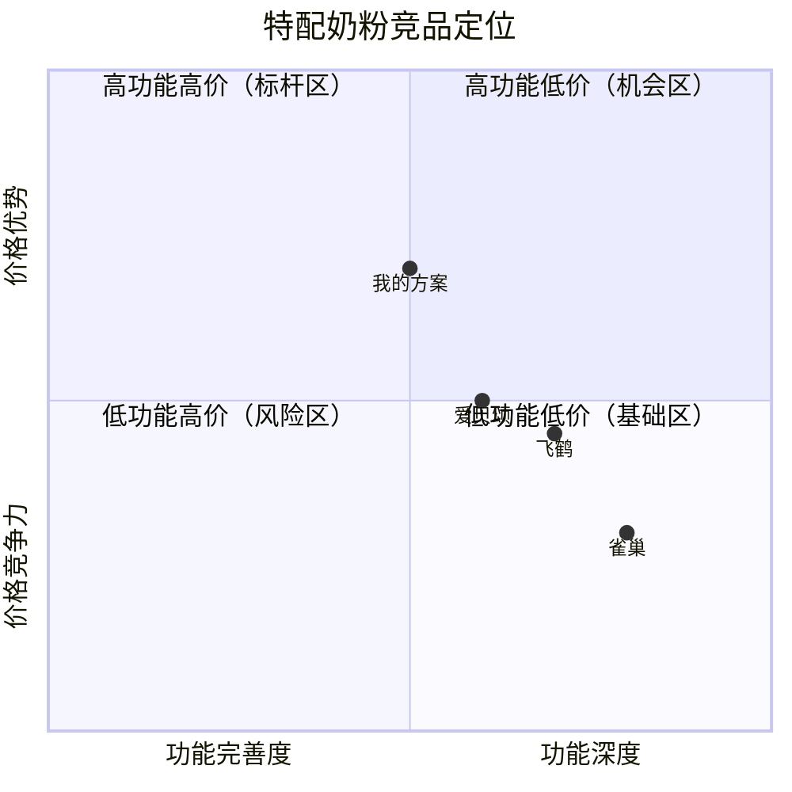

# 创业沙盘 · 用户需求验证方法论

> ⚠️ 本框架当前仅适用于 **ToC（面向消费者）** 方向。ToB / ToG 模式正在规划中。
>
> 文档状态：V4.6 全链路已定稿（竞品洞察重构 + 三路径统一全套 + 执行约束）
> 适用场景：ToC 方向，创业者已有初步方向但需验证
> 后续扩展：ToB / ToG 模式（待迭代）
> 宏观预判层：V1 已定稿

---

## 核心理念

> **不是验证"我的想法对不对"，而是"在所有可能的解释中，哪一个证据最强"**

- 行为由过去决定，不问未来假设，只挖已有行为
- 先验证"痛点是否真痛"，再做市场规模判断
- 验证不是一次性的，是"假设 → 访谈 → 修正 → 再访谈"的迭代循环
- **输出方向，不代做产品**（核心定位）：本 Skill 在 MVP 层面给用户 Go/No-Go 判断、方案方向、验证路径；**实际执行（访谈、桌面研究、产品搭建）由用户自己完成**。不做"代做"——即使用户说"我想做个 X Skill"，任务是验证"做 X 这个方向值不值得"，而不是替 TA 把 X 做出来

---

## 完整流程

```
┌─────────────────────────────────────────┐
│  入口 2问分流 → 推荐路径 A/B/C           │  ← 新增
│  (A新手极简 / B标准完整 / C高阶深度)      │
├─────────────────────────────────────────┤
│  Layer 0：宏观预判                        │
│  [A]三问信号灯 / [B]5步分析链 / [C]+合规  │
├─────────────────────────────────────────┤
│  Phase 0：不确定性扫描 + 快速画像 [A]     │
├─────────────────────────────────────────┤
│  Phase 1：假设分解 [A/B]                  │
├─────────────────────────────────────────┤
│  Phase 2：反假设生成 [B/C]                │
├─────────────────────────────────────────┤
│  Phase 3：优先级排序 → Top 3 [B/C]        │
├─────────────────────────────────────────┤
│  Phase 4-A/B：调研设计 + 访谈提纲 [B]     │
├─────────────────────────────────────────┤
│  决策门：6项评分卡 + 风险自查清单 [B]      │
├─────────────────────────────────────────┤
│  Phase 5：执行与反馈 + PMF判定 [B/C]      │
├─────────────────────────────────────────┤
│  Go / No-Go 决策（+ 红队视角）            │
├─────────────────────────────────────────┤
│  Phase 6：方案推演 [B] + 工具箱 [C]       │
└─────────────────────────────────────────┘
         ↕ 迭代循环（验证 → 修正 → 再验证）
         ↕ 每个阶段结束 → 升级检查点（四选一）
```

### 三条路径 · 按需选择

**同一套方法论内核，三种详略粒度**：

| 路径 | 定位 | 核心产出 | 耗时 |
|------|------|---------|------|
| 🟢 **A 新手极简主线** | 快速方向扫描，判断"值不值得继续" | 方向信号卡（三色判断） | 48h |
| 🔵 **B 标准完整流程** | 全链路验证，得到"已验证结论" | 完整验证报告（含置信度+PMF） | 1-4周 |
| 🟣 **C 高阶深度工具** | 深度推演，含商业模型健壮性 | 深度推演报告（含UE+敏感性） | 3-6周 |

**入口 2 问分流**：
```
Q1：验证目的？ A.快速看方向 / B.认真验证 / C.深度推演
Q2：访谈经验？ A.没做过 / B.做过几次 / C.有经验
```
**推荐逻辑**：新手（Q2=A）不直接进 B/C，先跑 A 拿信号再升级；快速看方向→A；认真验证→B（新手A升级B）；深度推演→C（新手B升级C）。

### 每步升级检查点（关键机制）

**每个阶段完成后，AI 呈现检查点，用户四选一：**

```
✅ 阶段完成：[阶段名] | 输出：[关键信号]

🔄 下一步怎么走？
① 升级路径 → 自动补全深度分析（A→B / B→C）
② 保持路径 → 继续下一阶段
③ 降级路径 → 简化后续环节（B→A）
④ 止损     → 结束，沉淀认知资产
```

**升级规则 = 自动补全，不重跑**：
- 保留已有产出（假设/信号/访谈记录），只补全缺失环节
- A→B 补齐：反假设≥3、Top3排序、四层五维提纲、跨访谈整合、PMF判定
- B→C 补齐：合规前置、杀手实验、样本分层、UE推演、敏感性分析

**止损规则 = 有价值的结束**：输出认知资产清单（验证了什么/什么证据/什么下次可用），呼应沉没成本提醒（见 5.7）。**若止损时已进入 Phase 6，认知资产清单必须含竞品 T1 摘要**（威胁排序 + 机会筛选 + 竞品存档块，格式见 6.1 存档降级规则）——竞品结论是认知资产的核心组成部分，不允许以"收尾"为由缺席。

---

---

## Layer 0：宏观环境与行业机会预判

**目的**：在大规模投入用户调研之前，先判断"现在是不是做这件事的正确时机"。创业是时代的产物，需要在正确的时机做正确的事。

**数据输入**：五维罗盘（在 5 步分析中贯穿使用）
- ① 政策风向：国家在推什么？监管在管什么？
- ② 社会趋势：人口结构、消费观念、生活方式变化
- ③ 技术成熟度：基础设施就绪否？用户习惯培养好了吗？
- ④ 经济周期：融资环境、消费信心、行业生命周期阶段
- ⑤ 竞争格局：头部玩家形成了还是格局未定？

---

### Step 0：合规强制检查（⚠️ 前置校验，[C]深度必做 / [B]标准建议做）

**目的**：在分析行业机会之前，先确认"这个生意在法律上能不能做"。高监管行业（食品、医美、特医、教育、金融、药品）合规就是生死线，**合规不通过直接 No-Go，不需要做后面的分析**。

| 检查项 | 核心问题 | 判断 |
|--------|---------|------|
| 特殊资质 | 需要特殊牌照/资质吗？（食品经营许可证/医疗器械注册/办学资质） | 有/无/不确定 |
| 政策监管 | 当前政策是鼓励、中性、还是强监管？ | 宽松/中性/强监管 |
| 取缔风险 | 是否存在政策取缔、整改、一刀切的风险？（参考：双减/P2P/电子烟） | 低/中/高 |

**输出**：合规信号 → 🟢 合规可行 / 🟡 有门槛需评估成本 / 🔴 直接 No-Go

> 💡 判断方法：搜"XX行业 监管政策 最新"、"XX 资质 办理条件"。拿不准时用"不确定"代替猜测——不确定本身就是需要进一步调研的信号。

---

### Step 1：行业归属 → 生命周期判断

**核心问题**：我的点子属于哪个行业？这个行业现在处于什么阶段？

| 阶段 | 特征 | 创业建议 |
|------|------|---------|
| 导入期 | 市场教育中，玩家少 | 需承担教育成本，适合有耐心的创业者 |
| 成长期 | 高速增长，格局未定 | ⭐ 最佳创业窗口，机会密集 |
| 成熟期 | 格局已定，头部垄断 | 需找细分/差异化切入点 |
| 衰退期 | 市场萎缩 | 除非颠覆性创新，否则不建议进入 |

> 💡 **差异化 vs 颠覆性创新**：
> - **微小差异化**（"我们便宜10%"、"多一个功能"）→ 在头部垄断的成熟市场**无法对抗**，头部可以用价格战/跟抄轻松碾碎你
> - **颠覆性创新**（解决品类级痛点/改变成本结构/服务被忽视的边缘人群）→ 才有机会切入垄断赛道
> - **判断标准**：你的差异点是"在既有赛道上做得更好"还是"重新定义了赛道"？前者在垄断市场风险极高。

---

### Step 2：产业链拆解 → 定位具体环节

**核心问题**：我切的是产业链的哪个环节？这个环节正在稳定还是变化？

**产业链五段**：上游（供应端）→ 中游（平台/技术）→ 下游（渠道/服务）→ 终端（消费者）

**重点**：判断所切入环节是否处于"变化期"——变化期通常意味着新旧模式交替，正是创业者的机会窗口。

---

### Step 3：变化洞察 → 创业窗口分析

**核心问题**：
1. 行业在发生什么变化？哪些变化是结构性（不可逆）的？
2. 这个变化适合创业吗？对创业机会的影响是什么？
3. 下一个稳态（变化后的稳定状态）是什么？

**结构性变化类型**：
- 技术革命（如 AI、区块链、5G）
- 人口变迁（老龄化、少子化、独居化）
- 政策转向（双减、集采、双碳）
- 渠道革命（直播电商、社区团购）
- 消费观念变迁（健康意识、国潮崛起）

---

### Step 4：行业增速 + 天花板

**核心问题**：这个赛道增长有多快？天花板有多高？是个大机会还是小生意？

**三维评估**：
| 维度 | 评估方式 |
|------|---------|
| 市场规模 | 千亿级/百亿级/十亿级 |
| 增速 | 高(>20%) / 中(5-20%) / 慢(<5%) / 负增长 |
| 天花板距离 | 远（还早）/ 近（快到了）/ 到了（已封顶） |

> 💡 **冷门细分赛道适配**（无公开数据时）：
> 小众垂直赛道（手工/本地细分服务）往往没有公开市场规模和增速数据。替代判断方法：
> - **类比市场**：找邻近行业的增速/集中度做参考（如"手工皮具"参考"定制礼品"）
> - **代理指标**：搜索量/小红书抖音话题热度/垂直社区活跃度，代理需求信号
> - **访谈反推**：用户数量（估算）× 客单价 × 复购频次，自己算天花板
> - **数据缺失本身是信号**：连数据都搜不到，可能赛道太小或太新——用小样本访谈快速验证，别在桌面研究上死磕

---

### Step 5：集中度分析 → 进入难度

**核心问题**：头部玩家已经形成了还是格局还没定？我进去有机会吗？

| 集中度 | CR3（前3市占率） | 进入难度 |
|--------|-----------------|---------|
| 高集中度 | >70% | 高，需颠覆性创新或差异化切入 |
| 中等 | 30%-70% | 中等，有机会但需明确差异化 |
| 低分散 | <30% | 低，蓝海市场，适合进入 |

> 💡 冷门赛道没有 CR3 数据时，改用**"认知集中度"**判断：让 5 个目标用户说出"这个品类你第一时间想到的品牌"——>3 个提到同一个品牌=高集中度；没有共识=分散市场（机会窗口）。

**输出**：综合时机信号 → 🟢 绿灯（适合进入）/ 🟡 黄灯（谨慎评估）/ 🔴 红灯（建议等待或换方向）

---

## Phase 0：不确定性扫描 + 快速画像

**目的**：帮助只有模糊想法的创业者定位自己最不确定的环节，快速建立用户画像雏形

**步骤**：
1. 用户自选切入点（不知道找谁聊 / 不知道怎么问 / 怕判断错）
2. 场景-行为-特征三连问，快速勾勒目标人群
3. 输出：粗画像 + 探索方向

---

### Phase 1：假设分解 → 可检验性子假设

**目的**：将模糊的"我觉得这事能行"拆解成多个可独立验证的子假设

**步骤**：
1. 将原始创业点子拆解为最小可验证单元
2. 每个子假设标注可检验性（🔵高 / 🟡中 / 🟢低）
3. 标记每个子假设的证据状态（已有证据 / 证据缺失 / 矛盾证据）

**可检验性判断标准**：
- 🔵高：直接通过用户访谈就能验证（如"用户最近遇到过这个问题吗"）
- 🟡中：需要侧面验证或需要更多用户才能判断
- 🟢低：无法通过访谈验证，需通过 MVP/数据等方式检验

**输出**：假设分解表

---

### Phase 2：反假设生成（≥3个）

**目的**：强制用户质疑自己的假设，避免证实偏差。用"如果不是A，那是什么？"的逻辑，主动寻找推翻自己假设的证据。

**每个反假设需包含**：
| 字段 | 说明 |
|------|------|
| 假设内容 | "如果不是 A，那是什么？" |
| 支持依据 | 什么证据支持这个反假设 |
| 不支持依据 | 什么证据反驳这个反假设 |
| 杀手实验 | 什么单一证据出现就足以证伪？（[C]深度必做） |

**反假设引导模板**（新手不会写时，AI 用引导式提问帮用户挖掘）：

| 典型反假设 | 引导提问（帮用户挖真实反方逻辑） |
|-----------|-------------------------------|
| 信任不在我这 | "用户现在从哪买？他们对现在的渠道哪里不满意？" |
| 用户群太小 | "你身边有 3 个以上符合画像的人吗？他们彼此认识吗？" |
| 真需求不是我以为的 | "如果用户不需要这个，他们现在在用什么替代？" |
| 市场教育成本太高 | "用户理解这个方案要花多大功夫？现在有人在做教育吗？" |
| 付费意愿极低 | "用户现在为类似问题花过钱吗？花在什么上？" |

**反假设有效性检查**（写完后逐条自检）：
- ✅ 有效：能被一次访谈/一组数据**推翻**（"用户付费意愿极低"→ 访谈中直接问过去付费行为）
- ❌ 无效：无法证伪的陈述（"用户没钱"→ 太宽泛，怎么算没钱？换成"用户过去半年为同类问题付过费吗"）

**典型反假设类型**：
- 信任不在我这（用户更信现有渠道）
- 用户群太小（细分市场不足以支撑商业模式）
- 真需求不是我以为的那个（真实痛点在别处）
- 市场教育成本太高（用户需要被先教育）
- 付费意愿极低（嘴上说想要但不掏钱）

**输出**：反假设清单（每条含支持/不支持依据）

---

### Phase 3：优先级排序 → Top 3

**目的**：从所有假设+子假设+反假设中识别出"最值得先验证"的 Top 3

**排序双轴**：
| 维度 | 说明 |
|------|------|
| 影响程度 | 如果这个假设为真，对创业决策的改变有多大 |
| 证据匮乏程度 | 当前对这个问题有多不确定 |

**综合评分**：影响程度 × 证据匮乏 → 得分最高者优先验证

**输出**：Top 3 优先验证假设

---

### Phase 4-A：调研设计 + 通过标准

**目的**：为每个 Top 假设设计可执行的调研方案，并明确"什么算验证通过"

**每个 Top 假设需设计**：
| 字段 | 说明 |
|------|------|
| 核心研究问题 | 访谈中要回答的那个具体问题 |
| 目标用户类型 | 需要找什么样的人聊 |
| 最低访谈人数 | 至少聊几个才能下结论 |
| 核心访谈问题 | 现场问的具体问题（建议 2-3 个核心问题） |
| 验证通过操作性定义 | 具体观察到什么现象才算"通过" |
| ⏱️ **本验证时间盒** | 最多投入 X 时间 / Y 金钱 |

> ⏱️ **时间盒说明**：给每个调研设定一个"最大投入"（如2周×6小时/周 + 500元奶茶费），超过这个投入仍无结论就触发 Go/No-Go 决策。防止无止境地"再聊一个"。

**操作性定义要点**：
- 可观察（基于已发生的行为或明确表态）
- 可计数（有明确的数量阈值）
- 可否定（如果达不到就是 No-Go）

**输出**：完整调研方案（含通过/不通过的判决标准）

> 💡 **可选扩展：非用户样本** — 如果你想验证"为什么有人知道但不用"，可以额外找 2-3 个"知道但不用"的人聊聊（不是必须）。核心问题："你听说过/见过这个方案吗？为什么没试过？"

> 💡 **分层分工说明**（重要）：
> - **人口属性（年龄/收入/城市/家庭结构）→ 用于"圈人"**：早期模糊方向时，用它快速筛选"谁值得访谈"，定出访谈对象范围
> - **行为维度（频率/自主性/渠道偏好/决策风格）→ 用于"分层"**：访谈数据回来后，用它分析不同用户群体的需求差异
> - **一句话**：人口属性帮你找到人，行为维度帮你读懂人。前者是漏斗，后者是显微镜。

---

### Phase 4-B：访谈提纲设计

**目的**：在调研方案确定"找谁、找几个、怎么算过"之后，进一步设计"怎么问、判断标准是什么"。

每个访谈问题都需要从 **四层 × 五维** 两个维度同时设计。

---

#### 四层结构（ToC 纵向递进）

访谈按"从表面到深层"的顺序推进，每一层解决一个核心问题：

| 层 | 探测目标 | 核心问题示例 | 关键判断 |
|----|---------|------------|---------|
| **第一层 · 功能层** | 用户当前的行为模式，为假设提供行为基线 | 「你平时是怎么做[相关行为]的？最近一次是什么场景？」 | 有稳定行为模式 → 有参考坐标；无行为模式 → 需求可能不真实 |
| **第二层 · 流程层** | 从「发生→应对→解决→结果」全流程中定位断点 | 「当时你第一步做了什么？然后呢？卡在了哪个环节？」 | 能清晰说出断点 → 痛点真实；流程模糊或跳过 → 痛点不深 |
| **第三层 · 情感层** | 用户在断点处的情绪强度和情绪类型（愤怒/焦虑/无奈/麻木） | 「当时你什么感觉？最让你抓狂的是什么？」 | 具体情绪词+细节 → 高需求；"还行/习惯了" → 已麻木 |
| **第四层 · 动机层** | 用户行为背后的根本驱动力——什么条件能促成改变 | 「如果这个问题彻底解决了，你的生活有什么不同？」 | 能具体描绘"解决后的样子" → 深层动机明确；"也没啥" → 表层需求 |

**递进逻辑**：功能层提供背景 → 流程层定位卡点 → 情感层量化痛感 → 动机层判断可撬动性。
**每一层都在为上一层之后的"所以呢"服务**，不是机械地问完四个问题就结束。

---

#### 关键解决问题（五维设计元数据）

**每个问题**在放入四层之前，都要先过这 5 个设计维度：

| 维度 | 说明 | 示例（C1 功能层） |
|------|------|-----------------|
| **🎯 探测目标** | 这个问题的回答帮我判断什么 | 摸清用户现有的购买渠道和选择逻辑 |
| **🟢 理想回答信号** | 用户怎么回答说明假设成立 | 清晰说出选择理由（价格/信任/方便） |
| **🔴 危险回答信号** | 用户怎么回答说明假设可能错了 | "就随便买的" / 说不出为什么 |
| **🔎 追问预案** | 用户回答出现哪些【关键词/情绪信号】时追问什么 | 提到[医院推荐/朋友介绍]→追问"这层信任怎么建立的" |
| **⚠️ 问法陷阱** | 这个问题最常见的问法错误是什么 | 不要问"你觉得抖音靠谱吗？"换成具体行为问 |

---

#### ToC 四层 × 五维完整示例

以下是用"抖音卖特配奶粉"案例中的 **C1（信任不在抖音）** 反假设做的完整设计：

**第一层 · 功能层 — 用户当前的渠道信任模式**

| 维度 | 内容 |
|------|------|
| Q | 「你最近一次买奶粉是在哪买的？为什么选那里？」 |
| 🎯 探测目标 | 摸清用户现有的购买渠道和选择逻辑 |
| 🟢 理想信号 | 清晰说出选择理由（价格/信任/方便）|
| 🔴 危险信号 | "就随便买的" / 说不出为什么 |
| 🔎 追问预案 | 说出[医院推荐/朋友介绍] → 追问"这层信任是怎么建立的"|
| ⚠️ 陷阱 | 不要问「你觉得抖音靠谱吗？」换成具体行为问 |

**第二层 · 流程层 — 从"知道渠道"到"信任下单"的完整链路**

| 维度 | 内容 |
|------|------|
| Q | 「你第一次在母婴店买奶粉之前，经历了哪些步骤才决定信任那家店？」 |
| 🎯 探测目标 | 拆解"信任建立"的步骤序列，看抖音缺了哪一步 |
| 🟢 理想信号 | 能还原完整链条（听说→去店里看→扫码验真→试喝→复购）|
| 🔴 危险信号 | "没想那么多，就去了"——信任建立是隐性的，需要追问 |
| 🔎 追问预案 | 提到[看资质/搜评价/问朋友] → 追问"当时看到了什么让你放心" |
| ⚠️ 陷阱 | 不要诱导"那你是不是很谨慎"，让ta自己说 |

**第三层 · 情感层 — 用户在"信任风险"场景下的真实情绪**

| 维度 | 内容 |
|------|------|
| Q | 「你买奶粉的时候，最担心什么？当时什么感觉？」 |
| 🎯 探测目标 | 判断信任顾虑是"情绪恐惧"还是"理性谨慎" |
| 🟢 理想信号 | 有具体担忧+具体场景（"我上次一扫发现查不到，吓死"）|
| 🔴 危险信号 | "反正别在抖音买就对了"——笼统拒绝，再追问具体事件 |
| 🔎 追问预案 | 出现[假货/扫码/不放心] → 追问"你说的不放心具体是指什么" |
| ⚠️ 陷阱 | 不要问"你对这事有多担心？"拿具体事件作为情绪锚点 |

**第四层 · 动机层 — 什么条件能让ta跨越"信任鸿沟"**

| 维度 | 内容 |
|------|------|
| Q | 「如果抖音上有一个卖特配奶粉的商家，你觉得ta得做到什么，你才会考虑下单？」 |
| 🎯 探测目标 | 找信任迁移的触发条件——这是 C1 验证的关键 |
| 🟢 理想信号 | 能说出具体条件（品牌授权/医生推荐/可退换/可验真）→ 信任可被构建 |
| 🔴 危险信号 | "多少钱我都不敢在抖音买" → 信任不可构建，C1 成立 |
| 🔎 追问预案 | 说到[品牌/授权] → 追问"如果ta能证明是品牌授权，你会愿意试试吗？" |
| ⚠️ 陷阱 | 不要先问"你觉得多少钱合适"——先探测信任问题本身 |

---

#### 五维设计的具体操作指南

**1. 探测目标怎么写**
- ✅ 好的目标：回答"这个问题是来验证哪个假设的哪一层"
- ❌ 差的目标：太宽泛（如"了解用户需求"）

**2. 理想/危险信号怎么写**
- ✅ 好的信号：基于**具体回答内容**的预测（"用户说花钱买过/找过解决方案"）
- ❌ 差的信号：基于**情绪判断**（"用户看起来很开心"）
- 信号要有"可判定性"——访谈结束后能不能明确说"这个人是强信号还是弱信号"

**3. 追问预案怎么写**
- ✅ 好的预案：给出【具体关键词→追问方向】的映射
- ❌ 差的预案：只说"再追问一下"但没有追问方向
- 追问的作用：避免"用户说了一个模糊回答但你没深挖"就跳到下一个问题

**4. 陷阱提醒怎么写**
- ✅ 好的陷阱：指出**常见的诱导性问法**，并在括号里给出替代方案
- ❌ 差的陷阱：只说"不要问错"但不告诉用户什么算错
- 陷阱是针对**提问者（创业者）**而不是针对**回答者（用户）**的

---

#### 不同 Top 假设的四层切入角度不同

虽然是同一套四层结构，但每个假设的切入角度完全不同。以下用"抖音卖特配奶粉"案例中的三个 Top 假设示范：

| 层 | H1（用户活跃在抖音） | C1（信任不在抖音） | H4（内容→电商接受度） |
|---|---------------------|------------------|---------------------|
| 功能层 | 你平时刷抖音看什么内容 | 你买奶粉在哪买？为什么 | 你有没有因为看视频买了东西 |
| 流程层 | 从看到→下单，经历哪几步 | 你是怎么信任那家母婴店的 | 从刷到视频→付款，中间犹豫过吗 |
| 情感层 | 在抖音买东西后感受如何 | 买奶粉最担心什么 | 下单那刻什么感觉 |
| 动机层 | 什么最打动你在抖音下单 | 抖音商家做到什么你会信 | 视频里什么让你觉得"这个可以买" |

**关键原则**：四层是**思考框架"脚手架"**，不是机械模板。每个假设套进去，四层会自然产出不同的具体问题。

---

## 决策门：6 项评分卡 · Go / No-Go

**位置**：Phase 4-B 访谈提纲设计完成后 → 进入 Phase 5 执行前。

**目的**：在开始执行调研之前，做一次"出发前检查"，确保你准备好了。5 项全部通过才进入 Phase 5，否则回退补齐。

| # | 检查项 | 判定 | 说明 |
|---|--------|------|------|
| 1 | ✅ **假设可检验** | YES / NO | Top 3 假设的每个问题设计都有明确的行为信号标准 |
| 2 | ✅ **受访者可达** | YES / NO | 确认能接触到≥最低人数的目标用户 |
| 3 | ✅ **方案无漏洞** | YES / NO | 访谈提纲的四层×五维没有明显遗漏 |
| 4 | ✅ **偏差已识别** | YES / NO | 对抗性自检中至少列出了自己可能犯的认知偏误 |
| 5 | ✅ **做好了"放弃"的准备** | YES / NO | 预设了如果数据不支持假设时的应对计划 |
| **6** | 🧠 **情绪状态检查** | **1-10分** | **你现在对这个点子的兴奋程度是几分？如果验证结果反对你的假设，你的第一反应是"再试一次"还是"接受结果"？如果是前者，建议休息24小时再做决策。** |

**通过规则**：1-5 项全部 YES + 第6项 < 9分（如果兴奋度≥9分，说明你已经"爱"上这个点子了，警惕确认偏误）→ 进入 Phase 5。否则回退到对应的 Phase 补齐。

---

## 全流程风险自查清单（统一风险看板）

> 分散在各个环节的偏差预警汇总成一张清单。**进入 Phase 5 前自查一遍，全流程结束后再复盘一遍。**

| # | 风险类型 | 自查问题 | 来源环节 |
|---|---------|---------|---------|
| 1 | 确认偏误 | 我是否只收集支持假设的证据，忽略了反对信号？ | Phase 5.3.4 对抗性自检 |
| 2 | 代表性偏差 | 这一个用户/这一个数据源能代表多少用户？ | Phase 5.3.4 / 5.4.5 |
| 3 | 解释过度 | 我是否把用户的随口一提当成了核心需求？ | Phase 5.3.4 |
| 4 | 提问诱导 | 访谈问题有没有诱导性问法（"你会用吗"→"你上次怎么做的"）？ | Phase 4-B 问法陷阱 |
| 5 | 采访错对象 | 访谈的是目标用户，还是"知道但不用"的人？ | Phase 4-A 样本设计 |
| 6 | 沉没成本 | 我是否因为已经投入而不愿承认方向错误？ | Phase 5.7 沉没成本提醒 |
| 7 | 致命风险 | 方案里有没有 🔴 致命风险（监管/巨头下场）没有应对策略？ | Phase 6.2.2 风险分类 |
| 8 | 情绪绑架 | 我的判断是基于数据还是基于对点子的热爱？ | 决策门第6项 |
| 9 | 数据缺失冒充结论 | 我用"没有数据"直接当"结论"了吗？冷门赛道用替代方法估了吗？ | Layer 0 Step 4/5 |
| 10 | 无效反假设 | 我的反假设能一次访谈推翻吗？还是写了个无法证伪的空话？ | Phase 2 有效性检查 |

**用法**：每个勾选"是"= 该项风险已识别；任一项答不上来 → 回到对应环节补齐。

---

## Phase 5：执行与反馈

**目的**：在推演阶段完成后，输出初步验证报告（含置信度标签），用户执行调研并反馈数据，AI 对每一条数据源执行结构化证据链追溯，累积足够后触发跨访谈整合，最终将报告置信度提升至"已验证"。

> ⚠️ **验证方式可选（用户期望管理）**：进入 Phase 5 时先询问用户验证方式——
> - **A 真人访谈**（证据最强，默认推荐）
> - **B 桌面证据推演**（更快看到方向；之后访谈结果可补进来整合，非二选一）
> - **C 暂不验证，先看方案推演**
> 用户无法访谈/现阶段不想访谈时，走 B 路径，避免流程因"访谈做不了"卡死。

---

### 5.1 AI 输出推演阶段验证报告

AI 基于 Layer 0 → Phase 4-B 的完整推演，输出一份结构化的验证报告。报告的核心特征：

**① 每项结论附带「置信度」标识**

| 置信度等级 | 含义 | 对应环节 |
|-----------|------|---------|
| 🟢 置信度高 | 基于公开数据和严谨推演，可靠性较高 | Layer 0（宏观预判） |
| 🟡 置信度中 | 逻辑自洽但未经验证，需实证检验 | Phase 1-3（假设推演） |
| 🔴 置信度低 | 尚未执行用户访谈，需要最优先验证 | Phase 4（需求验证结论） |

**② 明确标注「需验证假设」与「宏观确定性结论」的边界**

报告在显眼位置提醒用户：

> ⚠️ 本报告结论基于推演，不是验证。
> 请至少完成 Phase 4-A 中设计的 N 场用户访谈（或走桌面证据路径）后，
> 再依据实证数据做出 Go/No-Go 决策。

---

### 5.1.5 桌面证据路径（一等公民，非应急补丁）

**触发**：用户选择"先做桌面证据推演"，或明确"现阶段无法访谈"。

**流程**：
1. AI 联网搜索三类证据：真实用户发声（小红书/知乎/社群）/ 竞品生态 / 行业数据
2. 每条证据按「来源多样性矩阵」标注置信度（见下）
3. 对标 Phase 3 的 Top 3 假设，输出"初步验证结论（桌面证据版）"

**证据置信度分级（来源多样性矩阵）**：

> 说服力来自"不同性质来源的交叉印证"，不是数量堆砌。**3 个同性质来源 ≠ 强证据。**

| 等级 | 判定逻辑 | 示例 | 置信度 |
|------|---------|------|--------|
| 🟢 **强证据** | ≥2 种**不同性质**来源交叉一致 | 官方报告（定量）+ 真实用户原声（定性），结论一致 | 高（可支撑决策） |
| 🟡 **中证据** | 单一权威来源 / 多种**同性质**来源 | 只有官方报告；或只有多个用户评论 | 中（只能支撑方向） |
| 🔴 **弱证据** | 单一非权威/匿名来源 | 单个自媒体文章、无出处帖子 | 低（仅供参考） |

**来源性质分类**：
- 📊 官方/行业报告（白皮书、统计局、上市公司公告）
- 🗣️ 真实用户发声（评论、帖子、访谈原话）
- 📰 媒体报道/专业分析（权威媒体、行业分析师）
- 💼 竞品/商家信息（官网、价格、服务页面）

**可叠加整合**：桌面证据与访谈证据**可叠加**——用户之后拿到访谈结果，AI 将两类证据合并整合分析，不是二选一。整合时访谈证据权重高于桌面证据。

---

### 5.2 双通道数据反馈

用户选择以下方式反馈调研数据。**两种方式返回的数据都会由 AI 执行后续的结构化分析**。

#### 方式 A：粘贴原始聊天记录

用户把微信/语音转写的访谈记录直接贴回对话。AI 对原始文本执行完整的证据链追溯（5.3）。

#### 方式 B：填写结构化记录表

AI 提供一份最低门槛的结构化模板，用户访谈后按格式填写：

```
【访谈反馈】
受访者代号：_______
第一层·功能发现：________________________
第二层·流程断点：________________________
第三层·情绪信号：________________________
第四层·动机条件：________________________
整体信号（强/中/弱）：_______
一句话总结：______________________________
```

**两种方式的关系**：方式 A 数据质量更高（AI 可做深度分析），方式 B 门槛更低（用户 5 分钟填完）。如果用户能提供方式 A，建议优先；如果只能提供方式 B，AI 同样执行后续流程，但会在置信度标注中注明"基于用户自填记录"。

---

### 5.3 证据链追溯（AI · 单源分析）

**核心逻辑**：每一份数据源（无论是聊天记录、网络搜索结果、还是结构化记录表）进入后，AI 都独立执行一次完整的证据链追溯。这是 **"从原始对话到结构化证据"** 的转换过程，不依赖其他数据源。

**触发条件**：每次收到一条新数据源后立即执行，不等待累积。

---

#### 5.3.1 证据提取

对数据源进行全面扫描，提取每个有效信号，按以下三字段标注：

| 维度 | 说明 | 示例 |
|------|------|------|
| **📝 原文原句** | 每个信号必须引用原文，不转述、不概括 | 「我不敢在抖音买奶粉，怕买到假的」 |
| **🏷️ 信号类型** | 标注所属类别 | 痛点 / 期望 / 情感表达 / 行为描述 / 矛盾 / **沉默与回避** |
| **📊 信号强度** | 三档分级 | 🟢 强信号（明确提出）/ 🟡 弱信号（暗示）/ ⚪ 噪声（随口一提） |

**信号类型补充说明**：

| 类型 | 判断依据 |
|------|---------|
| 🟢 强信号 | 用户主动、具体地描述了一个问题或需求，有场景有细节 |
| 🟡 弱信号 | 用户暗示了某个需求，但表达模糊或需追问才能确认 |
| ⚪ 噪声 | 用户随口提到的内容，单次出现，无后续展开 |

**📌 信号类型新增：沉默与回避**（补充）

> 除了"用户说了什么"，还要标注"用户没说什么"。具体捕捉：
> - 对某个问题沉默 5 秒以上
> - 回避某类问题（"这个不太好说"、"跳过这个吧"）
> - 转移话题（没回答直接跳到另一个问题）
>
> **用户在哪个问题前停顿最久 → 那个问题可能触及了最核心的痛点或顾虑。**

---

#### 5.3.2 模式识别

将第一轮提取的信号按主题聚类，识别四个维度：

| 识别维度 | 说明 |
|---------|------|
| 🔁 **重复出现的模式** | 同一主题出现 2 次以上（即使在不同问题中） |
| ⚡ **用户自相矛盾** | 说的和做的不一致（"价格无所谓"但只买打折货） |
| ❤️ **情感密集时刻** | 用户突然变激动、变沉默、语气明显变化的位置 |
| 💡 **意外发现** | 跟你预期不符的任何内容——这是最值钱的信号 |

---

#### 5.3.3 假设检验

回到 Phase 3 的 Top 3 核心假设，逐条检验：

| 问题 | 判断方向 |
|------|---------|
| 这个用户的证据支持还是削弱了哪个假设？ | 列出受影响的假设 + 具体证据原文 |
| 置信度 | 🟢 高（有直接证据） / 🟡 中（有间接推断） / 🔴 低（纯推测） |

**输出示例**：
```
H1（用户活跃在抖音）→ 🟢 支持
  证据：用户说"我每天都在抖音刷好久，纸尿裤也在抖音买"
  置信度：🟢 高（直接行为证据）

C1（信任不在抖音）→ 不支持
  证据：用户说"抖音买辅食可以，奶粉我不敢"
  置信度：🟡 中（用户的限制条件不明确，需追问）
```

---

#### 5.3.4 对抗性自检

AI 作为分析者，在输出证据链追溯结论后，强制自检以下认知偏误：

| 偏误类型 | 自检问题 |
|---------|---------|
| ✅ **确认偏误** | 我是否过度重视支持假设的证据而忽略了反对证据？ |
| ✅ **代表性偏差** | 这一个用户能代表多少用户？我是否把一个特例当成了普遍现象？ |
| ✅ **解释过度** | 我是否把用户的随口一提当成了核心需求？是否有过度推断？ |

**输出要求**：必须指出本次单源分析中**至少 3 个可能存在的认知偏误**，即使最终结论认为偏误影响不大，也要列出。

**示例输出**：
```
🔍 本次分析可能存在的 3 个认知偏误：

1. **确认偏误**：用户的回答与 H1（活跃在抖音）高度一致，可能让我
   放松了对 H1 的反证据的搜索——用户没有提到"是否会持续购买"。
   
2. **代表性偏差**：这是一个"在抖音买过母婴用品"的用户，不能代表
   "所有过敏宝宝家长"。部分家长可能完全不刷抖音。
   
3. **解释过度**：用户说"可以考虑"，我将其标注为"有购买意向"。
   "可以考虑"和"会买"之间有巨大差距，可能高估了转化预期。
```

---

#### 5.3.5 单源分析暂存与提醒

**每份单源分析完成后，不立即触发后续流程，而是暂存并输出一份"初步扫描"结果。**

输出时带醒目的置信度提示：

> ⚠️ **这是一份基于 1 个数据源的初步扫描。**
> 单条数据可能包含偏激或特例信息。
> 请至少完成 3 份单源分析后，再查看跨访谈整合结论。

---

### 5.4 跨访谈整合（AI · 多源聚合）

**触发条件**：当 AI 累积了 ≥3 份单源分析后自动触发。

**核心逻辑**：不再分析单个数据源，而是把多条单源分析结果聚合起来，寻找跨源的主题、矛盾、分层和盲区。

---

#### 5.4.1 跨访谈主题矩阵

按"痛点 → 触发场景 → 当前方案 → 期望结果"四列整理。每行一个独立洞察点，标注：

| 字段 | 说明 |
|------|------|
| 提及该主题的用户数量 | N/X（X 为当前数据源总数） |
| 主题强度 | 🟢 强（多个用户自发提到）/ 🟡 中（被引导后确认）/ ⚪ 弱（个别提及） |

**示例**：
| 痛点 | 触发场景 | 当前方案 | 期望结果 | 提及 | 强度 |
|------|---------|---------|---------|------|------|
| 怕买到假奶粉 | 宝宝确诊过敏 | 只在医院/母婴店买 | 能验真、品牌授权 | 4/6 | 🟢 强 |
| 特配奶粉太贵 | 每月复购时 | 找代购/等打折 | 有稳定优惠渠道 | 3/6 | 🟡 中 |

---

#### 5.4.2 矛盾与用户分层

| 分析维度 | 具体内容 |
|---------|---------|
| **矛盾观点** | 用户之间有什么矛盾的观点？（如"希望自己挑选" vs "希望 AI 直接给结论"）|
| **分层暗示** | 这些矛盾是否暗示了不同的用户分层？ |
| **分层维度建议** | 使用**行为维度**（非人口统计）进行分层： |

**行为分层推荐维度**（补充）：

| 分层维度 | 说明 |
|---------|------|
| 📊 **频率** | 高频用户 vs 低频用户（对痛点敏感度的分层） |
| 🏃 **自主性** | 主动找方案 vs 被动等待 |
| 🔗 **渠道偏好** | 线上信任型 vs 线下信任型 |
| 🧠 **决策风格** | 理性比较型 / 感性冲动型 / 信任依赖型 / 习惯固守型 |

---

#### 5.4.3 假设置信度汇总矩阵（补充）

在跨访谈整合阶段，专门针对 Phase 3 的 Top 3 假设，输出一张汇总表：

| 假设 | 受访者1 | 受访者2 | 受访者3 | ... | 总支持 | 总反对 | 综合判断 |
|------|---------|---------|---------|-----|--------|--------|---------|
| H1（用户活跃在抖音） | 支持 | 支持 | 反对 | | 4/6 | 1/6 | 🟡 部分支持 |
| C1（信任不在抖音） | 支持 | 反对 | 未涉及 | | 2/5 | 3/5 | 🔴 不成立 |
| H4（内容→电商接受度） | 未涉及 | 支持 | 支持 | | 3/4 | 0/4 | 🟡 待定 |

**目的**：让创业者一眼看到——每个假设在全量受访者中的支持/反对分布，而非凭感觉判断。

---

#### 5.4.4 可用洞察摘要

将以上分析浓缩为 **200 字以内**的洞察陈述，必须包含：

| 必含要素 | 说明 |
|---------|------|
| 🔍 **核心发现** | 本次跨访谈整合的最重要结论 |
| 👥 **受影响用户群** | 多少用户、哪类用户受此影响 |
| 📌 **建议方向** | 基于证据的下一步建议 |
| ❓ **关键不确定性** | 哪些问题仍然没有答案 |

---

#### 5.4.5 分析盲区自检

| 自检问题 | 判断 |
|---------|------|
| 🟢 哪些结论非常确信？ | 多用户 + 多渠道证据一致的结论 |
| 🟡 哪些结论只是推测？ | 单一来源或间接推断的结论 |
| 🔵 还需要什么额外信息？ | 把"推测"升级为"确信"所需的具体信息 |

---

### 5.5 噪声二次机会机制（补充）

**核心规则**：噪声标记只是在单源分析中的占位。进入跨访谈整合时，AI 对所有标记为 ⚪"噪声" 的信号进行扫描：

```
如果同一个噪声主题在 ≥2 个不同数据源中出现
    → 自动升级为 🟡"待观察"信号
    → 纳入主题矩阵并标注"从噪声升级"
    
如果在更多数据源中再次出现
    → 继续升级
```

**逻辑**：单个受访者随口一提可能是闲聊，但两个人在不同场景下都提到同一个事——就不再是噪声了。

---

### 5.6 置信度更新与报告升级

AI 每次完成一条数据源的分析后，回顾更新所有假设的置信度状态：

```
🔴 证据缺失（初始状态）
     ↓ 收到 1 份单源分析
🟡 部分支持（有初步证据，但仅来自单一来源）
     ↓ 跨访谈整合 → 支持 ≥3 个来源
🟢 置信度高（多来源证据一致）
```

当所有 Top 3 假设的置信度都达到 🟢高 时，报告状态从「推演」变为「已验证」。

**报告输出分层**（补充）：

为降低信息密度，跨访谈整合的输出按三个优先级呈现：

| 层级 | 内容 | 说明 |
|------|------|------|
| 📌 **Tier 1 · 必须看** | 假设置信度汇总矩阵 + 可用洞察摘要（200 字） | 直接回答"该不该 Go" |
| 📖 **Tier 2 · 建议看** | 跨访谈主题矩阵 + 用户分层建议 | 帮助理解产品定位 |
| 🔍 **Tier 3 · 深度参考** | 对抗性自检 + 分析盲区 | 防止判断失误 |

**开放假设清单**：在置信度更新过程中，AI 持续维护一份"所有尚未验证的假设"清单，并标注每个假设的当前状态（未启动/进行中/已关闭/已验证），帮助用户追踪验证进展，防止"验证完 Top 3 就停下来"。

---

### 5.7 PMF 综合判定与停止条件

#### PMF 判定卡

在跨访谈整合完成后，AI 依据实证数据对每个 Top 假设进行 PMF 判定：

| 判定项 | 通过线 | 数据来源 |
|--------|--------|---------|
| 🚫 **拒绝信号扫描** | 受访者中"多少钱都不买"比例 < 30% | Phase 4-B 动机层 |
| 💰 **付费意愿** | ≥N/X 给出具体金额或明确"愿意付费" | Phase 4-B 动机层追问 |
| 🔥 **痛感强度** | ≥N/X 情感层信号为"强" | Phase 4-B 情感层 |
| 💊 **替代方案痛苦度** | 当前方案描述含负面情绪 | Phase 5.4.1 主题矩阵 |
| 🔁 **留存意愿** | ≥N/X 表示"会持续使用/复购" | Phase 4-B 动机层追问 |
| 📊 **Sean Ellis PMF 测试** | 如果产品消失，≥40%受访者表示"非常失望" | 见下方「预 PMF 替代问题」 |

> ⚠️ **预 PMF 访谈替代问题**（关键修正）：
> 标准 Sean Ellis 测试问"**如果这个产品消失了**，你会多失望？"——它默认产品已存在且用户正在使用。**但本流程在点子早期验证阶段，产品还没做出来，直接套用会失效。**
> 早期阶段改用 **情景投射替代问法**：
> - 「假设你已经在用一款能解决这个问题的产品，它突然停止服务了，你会多失望？」（选项：非常失望/有点失望/无所谓/根本不会用）
> - 统计"非常失望"比例 ≥40% 视为通过
> - 或使用**三指标代理**：痛点频率高（≥5次/半年）× 主动寻求过方案 × 付费意愿明确——三者同时满足视为等效 PMF 信号

**通过规则**：≥4/6 项通过 → PMF 趋势积极；3/6 项通过 → 需要补充数据；≤2/6 项通过 → PMF 风险高。

#### 停止条件

明确的终点线，避免开放式迭代：

```
Phase 4-A 中设定的「验证通过操作性定义」
     ↓
所有 Top 3 假设的置信度达到验证通过标准
     ↓
PMF 判定卡 ≥4/6 通过
     ↓
输出「已验证」版本报告
     ↓
用户做出最终 Go/No-Go 决策
```

#### 🧠 沉没成本提醒

> 截至当前，你在这个方向上已经投入了 _____（时间/金钱）。请记住：已经投入的成本不应该影响你对未来的决策。如果数据说不行，及时停止是理性的选择，不是失败。

---

## Phase 6：解决方案推演

**目的**：在需求验证通过（或部分通过）后，从"痛点确实存在"进入"什么方案能走通"的推演阶段。提供思路框架供用户参考，而非强加一套重型流程。

> ⛔ **入口判定**：仅当 Go/No-Go 决策为 **Go**（或"部分验证通过，进入方案推演"）时才进入本阶段。**No-Go → 流程终止**（或仅做 6.1 竞品洞察作为"为什么不做"的证据补充），不进入 6.2 方案生成。
>
> 🚪 **必做闸门**：一旦进入 Phase 6，**6.1 竞品洞察为强制环节**——任何路径（A/B/C）、任何收尾方式（正常完成 / 止损 / 存档 / 出认知资产报告）均**不可跳过**。止损收尾时允许按 6.1 末尾的"存档降级规则"降级执行，但禁止整环节缺席。

**入口双模式**：

| 模式 | 用户状态 | AI 做什么 |
|------|---------|---------|
| 🅰️ **无方案** | 用户有需求洞察但不知道做什么 | 基于竞品洞察+用户洞察，生成多套方案选项供选择 |
| 🅱️ **有方案** | 用户已有明确的解决方案想法 | 通过竞品洞察定位方案，判断可行性 |

**两条路径共享竞品洞察引擎，输出最终方案建议。**

---

### 6.1 竞品洞察

**统一要求**：三条路径（A/B/C）在此环节统一做全套——竞品分析是方案推演的质量地基，不做精简。

> 🛑 **不可跳过**：竞品洞察是 Phase 6 的**强制环节**，任何路径、任何收尾场景（含止损/存档/出认知资产报告）均不可整环节跳过。收尾时可走"存档降级规则"（见 6.1 末尾），但至少完成 6.1.1 搜索锚定 + 6.1.2 识别与全局总结（威胁等级），并把 T1 结论（威胁排序 + 机会筛选）写入进度存档——这是认知资产的组成部分，不是可选项。**判断标准：一份没有竞品环节的存档/报告 = 流程缺陷，应打回补做。**

**执行约束**（保证"深度可控的全套"，防止耗时失控和信息过载）：

| 约束 | 说明 |
|------|------|
| 🚪 **必做闸门** | 竞品洞察为 Phase 6 强制环节：任何路径、任何收尾场景均不可整环节跳过；止损/存档时按 6.1 末尾降级规则至少完成 6.1.1 + 6.1.2，禁止缺席 |
| 🧩 **交互约束** | 按 5 个子步骤分块推进，每步确认后再进下一步，不一次性输出全部（遵循全局"一次一主题块"） |
| ⏱️ **时间盒** | 竞品洞察建议 2-4h 内完成；超过则输出精简版（只拆高威胁竞品 + 只做决策层对比），并标注"精简版" |
| 📊 **输出分层** | T1 必看（威胁排序 + 机会筛选结论）→ T2 详情（拆解表，想看哪个竞品的拆解说"展开"）；每个竞品拆解 ≤150 字 |
| 📚 **降级路径** | 无法联网时，降级为训练数据版（标注知识截止日期），仅输出全局总结 + 威胁等级 + 机会识别（跳过深度拆解和对比矩阵），并提示"结论置信度下降，建议后续联网复核"——与 Phase 5 桌面证据兜底逻辑一致 |
| ⚖️ **合规边界** | 竞品分析基于公开信息、仅供决策参考，不构成对竞品的评价结论；差评只提炼要点，不引用原文（版权/平台条款） |

**入口双模式**：

| 模式 | 用户状态 | 竞品分析的目的 | 功能对比列填什么 |
|------|---------|--------------|----------------|
| 🅰️ **无方案** | 用户有需求洞察但不知道做什么 | 确认市场空白是否存在 | "假设方案需求点"（继承上游假设） |
| 🅱️ **有方案** | 用户已有明确的解决方案想法 | 定位自身方案在竞争格局中的位置 | "我的产品" |

**整体流程**：搜索锚定 → 竞品识别与全局总结 → 按威胁等级逐个深度拆解 → 多竞品对比矩阵 → 差异化机会识别。

---

#### 6.1.1 搜索锚定

**输入**：Phase 1-3 的 Top3 假设 + Phase 5 访谈中用户提及的竞品。

**关键词建议**（基于上游假设自动生成三类关键词）：

| 关键词类型 | 生成依据 | 示例（特配奶粉案例） |
|-----------|---------|-------------------|
| 🏷️ **产品具体名称** | 从假设中的解决方案推导 | "特配奶粉" "水解奶粉" "纽康特" |
| 👥 **目标用户** | 从假设中的目标人群推导 | "过敏宝宝奶粉" "宝妈 低敏" |
| 🩹 **痛点** | 从假设中的核心痛点推导 | "水解奶粉真假" "特配奶粉 买不到" |

**联网扫描**：锚定上述关键词搜索，覆盖 ≥3 个信息源类型（电商平台评论区 / 内容平台（小红书·知乎·抖音）/ 行业报告 / 竞品官网）。

**来源标注**（沿用规则，所有信息必须标注）：

| 来源类型 | 标注格式 | 示例 |
|---------|---------|------|
| 🌐 **联网搜索** | 🌐 [来源]（搜索日期：YYYY-MM-DD） | 🌐 抖音电商公开数据（搜索日期：2026-07-30） |
| 📚 **训练数据** | 📚 [来源]（知识截止日期：YYYY-MM） | 📚 商业分析报告（知识截止日期：2025-12） |
| 💬 **用户访谈反馈** | 💬 [来源]（N/X 受访者提及） | 💬 用户访谈（3/6 受访者提到） |

**时效性分级**（按数据类型分级，而非一刀切）：

| 数据类型 | 建议有效期 | 超期处理 | 理由 |
|---------|-----------|---------|------|
| 定价/促销信息 | ≤1 个月 | 标注"⚠️ 可能已变化，建议复核" | 电商促销、调价频繁 |
| 功能/产品迭代 | ≤3 个月 | 正常使用，标注日期 | 产品迭代周期通常 1-3 月 |
| 用户评价趋势 | ≤3 个月 | 正常使用 | 评价是累积的，但趋势会变 |
| 商业模式/战略 | ≤6 个月 | 正常使用 | 战略调整周期较长 |
| 品牌定位/壁垒 | ≤12 个月 | 正常使用 | 相对稳定 |

> 🔄 **关键数据快速复核**：最终输出前，对定价、竞品是否仍在运营这两个最易过期的数据点做一次快速搜索确认，标注"复核日期"。用户可自行判断不同来源的可信度——联网搜索获得的最新信息权重高于训练数据中的泛化知识。

---

#### 6.1.2 竞品识别与全局总结

将市场中的相关玩家分为五层，确保视野不局限于直接竞品：

| 类型 | 定义 | 示例（特配奶粉案例） |
|------|------|-------------------|
| **直接竞品** | 解决相同问题、面向相同人群 | 其他抖音特配奶粉商家（小众） |
| **间接竞品** | 解决相同问题但渠道/方式不同 | 母婴店特配奶粉专柜、医院药房 |
| **替代方案** | 用户目前凑合用的方案 | 代购、跨境海淘、普通奶粉替代 |
| **潜在威胁** | 现在不竞争但随时可能进入的玩家 | 美团买药上线特医食品板块 |
| ⭐ **跨界打击者** | 看起来不相关但可能从边缘杀入 | 美团（有配送体系+本地服务基建+用户习惯） |

**数量基线**：五层每层至少识别 1 个；直接竞品至少 3 个；总量控制在 8-12 个（避免信息过载）。

**全局总结表**（先总览，再深入——用户先一眼看清全貌，再决定深入读哪个竞品）：

| 竞品 | 层级 | 一句话总结 | 信息新鲜度 | 威胁等级 |
|------|------|-----------|-----------|---------|
| 飞鹤 | 直接 | 品牌联合经营，单场单日销售额超350万 | 🟢 搜索于2026-07-30 | 高 |
| 爱贝颂 | 直接 | 低敏奶粉新品牌，精耕线下+内容种草 | 🟢 搜索于2026-07-30 | 中 |
| 雀巢/达能 | 直接 | 大牌旗舰店，抖音非主力渠道 | 🟢 搜索于2026-07-30 | 中 |
| 线下母婴店 | 间接 | 关系信任模式，"老板微信提醒复购" | 💬 访谈 4/6 提及 | 中 |
| 美团 | 跨界 | 有本地配送体系，随时可上线母婴品类 | 🟢 搜索于2026-07-30 | 高 |

**威胁等级评估**（= 拆解优先级）：
- 🔴 **高**：直接抢你的目标用户/资源，或随时可能进入并碾压
- 🟡 **中**：可能近期进入，或在你目标细分上有布局
- 🟢 **低**：暂时不构成威胁

> **低威胁竞品只留在全局总结表，不展开深度拆解。**

**信号检查（反馈环）**：全局总结完成后做一次信号检查，任一命中即返回 6.1.1 扩展关键词重新扫描（最多迭代 1 轮，避免无限循环）：

| 检查项 | 阈值 | 命中处理 |
|--------|------|---------|
| 竞品总数 | < 8 个 | 扩展行业词/渠道词/竞品品牌名，重扫 |
| 直接竞品数 | < 3 个 | 换搜索平台 / 补充长尾关键词 |
| 高威胁竞品信息 | 关键维度缺 ≥ 2 个 | 对该竞品做定向深搜（官网/财报/评价） |

---

#### 6.1.3 竞品深度拆解

按威胁等级从高到低逐个拆解，**每个竞品拆解前先一句话说明威胁原因**（例如："飞鹤——品牌资源碾压，且已在抖音本地生活验证跑通"）。每个竞品从以下 6 个维度展开：

**① 产品定位 + 价值主张**

| 问题 | 说明 |
|------|------|
| 竞品如何定义自己？ | 定位语、宣传口号、目标用户 |
| 目标用户是谁？ | 核心画像 + 规模 |
| **认知差异比对** | 竞品自认为的定位 vs 用户实际感知——**gap 越大，切入机会越大**（用户根本不认可它的定位，或它没兑现承诺） |

**② 功能列表**

- AI 根据行业 + 竞品官网/功能页生成初始清单（10-15 个核心功能点）→ **用户确认/补充/删减** → 确认后进入对比
- 每个功能标注与"我的产品 / 假设方案需求点"的区别：更强 / 更弱 / 相同 / 缺失

**③ 用户关键流程体验**

从发现到购买的完整路径，每个环节标注亮点和断点：

| 环节 | 亮点（可借鉴） | 断点（用户流失点，可切入） |
|------|--------------|--------------------------|
| 发现 | 例：短视频种草曝光量大 | 例：搜索"特配奶粉"找不到店铺 |
| 了解 | 例：详情页专业性强 | 例：成分说明看不懂 |
| 比较 | 例：价格透明 | 例：真假难辨，不敢比价 |
| 决策 | 例：直播促单话术强 | 例：无试用装，怕买错 |
| 购买 | 例：下单流程顺畅 | 例：支付后无售后指引 |
| 使用/复购 | 例："老板微信提醒复购" | 例：断货后无替代方案 |

**④ 商业模式 + 定价**

- 收入来源？成本结构？单位经济？
- 定价策略：免费 / 订阅 / 一次性 / 分成 / 佣金
- **增长策略**：靠什么获客？广告 / 内容 / 口碑 / 渠道合作

**⑤ 用户评价挖掘**

| 分析项 | 说明 |
|--------|------|
| 好评 Top3 | 竞品做对了什么（可借鉴） |
| 差评 Top3 | 竞品做错了什么（可切入） |
| **潜在切换动机** | 从差评中提炼"用户为什么会考虑切换到你的产品"——每条差评转化一个可承接的机会点。例：差评"真假难辨、不敢买" → 切换动机"需要一个能证明真货的渠道" |

> ⚖️ 差评/好评只**提炼要点**（如"用户普遍反馈真假难辨"），不引用原文大段复制——评论内容受平台条款与版权约束。

**⑥ 综合评估**

| 评估项 | 核心问题 |
|--------|---------|
| 核心护城河 | 什么阻止别人抄它？品牌 / 网络效应 / 技术 / 资源 / 供应链 |
| 短板 | 它的软肋在哪？重资产 / 响应慢 / 服务差 / 品类窄 |
| **逆向视角** | 假如你是这个竞品的操盘者，你该如何应对新进入者？→ 提前预判对手可能的反击（如：降价、封杀渠道、跟进你的卖点），为 6.2 方案的风险点提供输入 |

---

#### 6.1.4 多竞品对比矩阵

**① 用户决策层对比**

选取 6-8 个用户购买时最在意的因素（依据：上游用户访谈 + 竞品评价挖掘），每个因素对每个竞品 + 我的产品按 1-5 分评分：

| 决策因素 | 竞品 A | 竞品 B | 竞品 C | 我的产品 | 差距小结 |
|---------|--------|--------|--------|---------|---------|
| 例：价格 | 4 | 3 | 5 | 2 | 需补价格竞争力 |
| 例：信任度 | 4 | 4 | 5 | 1 | 最大短板，差异化机会 |
| 例：专业指导 | 2 | 1 | 3 | 5 | 领先，可做主打 |
| ...（共6-8项） | | | | | |

**② 核心功能覆盖对比**

10-15 个核心功能点逐一标注完善度（强/中/弱/无）→ 输出四类结论：

| 结论类型 | 定义 | 示例（特配奶粉） |
|---------|------|----------------|
| ✅ **行业标配功能** | 所有竞品都有 → Kano 基本型（没有会死，有也无人喝彩） | 正品保障、物流 |
| 🚀 **我们独有/竞品普遍缺失** | 差异化武器 | 验真追溯、喂养指导 |
| 📉 **我们最大的能力缺口**（vs Top 2 直接竞品） | 补课清单 | 供应链议价、品牌心智 |
| 🖼️ **各竞品能力画像** | 每个竞品一句话总结能力特征 | "飞鹤=品牌+流量碾压，功能全但服务弱" |

**③ Mermaid 定位矩阵**

从候选轴库中选取**最合适的两轴**生成 quadrantChart 定位矩阵，图下标注轴选择理由：

| 候选轴 A | 候选轴 B | 适合场景 |
|---------|---------|---------|
| 功能完善度 | 价格竞争力 | 同类产品直接竞争 |
| 差异化程度 | 进入壁垒 | 判断切入难度 |
| 用户满意度 | 增长势能 | 判断市场机会窗口 |
| 信任度 | 便利性 | 信任敏感型品类（食品/医美/母婴） |



> 💡 轴选择标准：优先选择**能区分出机会空白的轴对**——如果所有竞品都挤在同一区域，说明轴没选对，换一组候选轴重画。

**④ 自检（元认知）**

指出本次分析中**最可能出错的 2 个判断** + 为什么。常见错误源：

- **信息过期**：竞品定价/功能可能已变化
- **样本偏差**：差评样本可能集中在少数极端用户
- **类比不当**：拿不同业态的竞品强行对比
- **锚定偏见**：把"我希望的定位"当成了"市场事实"

> 格式与 Phase 5.3.4 对抗性自检统一（确信 / 推测 / 升级路径），避免自检流于形式——每个判断必须写明"为什么可能错"和"升级路径（怎么确认）"。

---

#### 6.1.5 差异化机会识别（结论汇总）

综合以上分析，定位三个方向的切入机会。此处的"差评高频主题"应整合 6.1.3-⑤ 提炼出的**潜在切换动机**——每个机会点都要能回答"用户为什么切到我"：

| 机会类型 | 核心问题 | 示例（特配奶粉） |
|---------|---------|----------------|
| 🕳️ **竞品缺失能力** | 竞品都不做或做不好的功能是什么？ | 全流程验真追溯（防伪溯源） |
| 📢 **用户差评高频主题** | 竞品评论区/小红书/知乎上高频出现的吐槽（含切换动机） | "不知道哪家靠谱"、"怕买到假货" → 切换动机：需要一个能证明真货的渠道 |
| 🎯 **可切入方向** | 结合自身资源与能力的差异化切入点 | "专业科普内容+验真服务+精选渠道" |

**机会优先级筛选（轻量标记）**：对每个可切入方向标注三个维度并汇总优先级，帮助用户快速聚焦"先做哪个"。此处只做轻量标记，**完整资源评估留给 6.2.3 创业者适配度**，不重复：

| 筛选维度 | 核心问题 | 标注 |
|---------|---------|------|
| 🧩 **资源匹配度** | 我现有资源/能力够得着吗？ | ✅ 够 / ⚠️ 需补 / ❌ 缺太多 |
| 🎯 **差异化强度** | 与竞品差距是否足够大、可持续？ | ✅ 强 / ⚠️ 中 / ❌ 弱 |
| 🛡️ **可防御性** | 做出来后别人难抄吗？ | ✅ 难抄 / ⚠️ 一般 / ❌ 易抄 |

**汇总规则**：≥2 个 ✅ = 🔴 高优先级；2 个 ⚠️ 或 1 个 ✅ = 🟡 中优先级；其余 = 🟢 低优先级。高优先级机会优先输出给 6.2 方案生成。

---

**✅ 输出验收清单**（6.1 提交前 AI 自查 3 项，用户 10 秒确认）：

| # | 自查项 |
|---|--------|
| 1 | 高威胁竞品是否全部完成 6 维拆解？（漏了哪个 → 补拆） |
| 2 | 每条竞品信息是否有来源 + 新鲜度标注？（缺标注 = 视为未验证信息） |
| 3 | 自检的 2 个判断是否写明了"为什么可能错"？（只列判断没原因 = 视为未完成） |

**📦 竞品存档**（跨会话恢复用，与全局进度存档呼应）：

```
竞品存档 · 已搜关键词：___ ｜ 已拆解竞品：___ ｜ 待拆解：___ ｜ 待复核数据点：___
```

**🛑 存档/止损降级规则**：因止损、时间不足或出"认知资产报告"等收尾场景，竞品洞察**允许降级但不允许缺席**。降级执行步骤：

| 步骤 | 要求 |
|------|------|
| ① 至少完成 | **6.1.1 搜索锚定**（三类关键词 + ≥3 信息源 + 时效性标注） |
| ② 至少完成 | **6.1.2 识别与全局总结**（五层分层 + 数量基线 + 威胁等级排序） |
| ③ 输出 T1 摘要 | 以下三块写入进度存档（格式见下） |
| ④ 显式标注 | 输出必须标注 **"⚠️ 精简版：深度拆解（6.1.3）与对比矩阵（6.1.4）未完成"**，并提示"下次续跑从补齐 6.1.3 深度拆解开始" |

**T1 摘要写入存档的格式**：

```
竞品 T1 摘要
- 威胁排序：① ___（威胁原因：___） ② ___ ③ ___
- 机会筛选：Top 方向 ___（优先级：🔴高/🟡中/🟢低）
- 竞品存档：已搜关键词 ___ ｜ 已拆解 ___ ｜ 待复核数据点 ___
```

> **判断标准**：一份没有竞品环节的存档/认知资产报告 = 流程缺陷，应打回补做 6.1.1 + 6.1.2。竞品结论（谁在威胁你、空白在哪）是认知资产的核心组成部分，不是可选项。

**🔗 衔接 6.2**：6.1 的威胁等级与机会筛选将直接决定 6.2 方案生成的方向权重——高威胁竞品的空白地带 = 方案首选方向；低威胁竞品的能力 = 方案借鉴点（对应 6.2.1 的"竞品借鉴点"标注）。

---

### 6.2 解决方案生成 / 验证

#### 6.2.1 方案多维列举

以上一步的用户洞察 + 竞品洞察为基础，从以下 5 个维度生成/评估方案：

| 维度 | 核心问题 | 示例（特配奶粉） |
|------|---------|----------------|
| 🎯 **需求侧重点** | 主打解决哪个最痛的痛点 | 信任问题（验真） / 价格问题（比价） / 选择问题（推荐） |
| 🧩 **解决方案** | 具体做什么产品/服务 | 做内容号（科普种草） vs 做严选店（货源验真） vs 做社群（信任口碑） |
| 💰 **商业模式** | 怎么赚钱 | 自营差价 / 佣金分成 / 会员订阅 / 广告商单 |
| 🚀 **增长策略** | 怎么获客 | 内容自然流量 / 投流 / 口碑裂变 / 渠道合作 |
| 🛡️ **壁垒构建** | 怎么不被抄 | 专业壁垒（医生背书） / 品牌信任 / 供应链独家合作 |

**每个方案必须标注**：

| 标注维度 | 说明 |
|---------|------|
| ⭐ **优先级** | 高 / 中 / 低（基于综合可行性） |
| 💡 **竞品借鉴点** | 这个方案借鉴了哪个竞品的什么做法 |
| ✨ **创新点** | 这个方案和现有方案比，新在哪 |
| ⚠️ **风险点** | 分三类标注（见 6.2.2） |

---

#### 6.2.2 风险点分类

每个方案的风险点必须按 **可控性** 分类：

| 风险类型 | 定义 | 示例 |
|---------|------|------|
| 🟢 **可控风险** | 可以通过努力降低 | 用户获取成本高 → 通过内容营销降低 |
| 🟡 **不可控但可适应** | 市场变化但可以调整策略应对 | 竞品降价 → 通过差异化服务应对 |
| 🔴 **致命风险** | 一旦发生全盘皆输 | 监管政策变化、巨头亲自下场 |

**判断标准**：如果方案中包含 ≥1 个 🔴 致命风险且没有清晰的应对策略，该方案应标记为"高风险"并建议用户着重评估。

---

#### 6.2.3 创业者适配度评估

> 🔗 **防重复**：若 6.1.5 已做机会筛选，此处直接引用其结论（资源匹配度/差异化强度/可防御性标注），仅对 🔴 高优先级机会做完整适配度评估，不重复。6.1.5 的"资源匹配度 ⚠️/❌"就是此处"所需核心能力"的先行信号。

每个方案附带一份"路况说明"（不是"资格判定"），帮助用户对照自身情况判断可行性：

| 适配维度 | 问题 | 评估方式 | 你对照一下 |
|---------|------|---------|-----------|
| 💰 **所需启动资金** | 这个方案要花多少钱启动？ | 估算范围（如 <1万 / 1-5万 / 5-20万 / >20万） | 你手头有多少？能扛多久没收入？ |
| 🧠 **所需核心能力** | 需要什么技能/资源？ | 技术 / 行业资源 / 内容创作 / 供应链管理 | 你有哪几项？缺的几项能补吗？ |
| ⏱️ **出第一个版本时间** | MVP 要多快能做出来？ | <1周 / 1-4周 / 1-3月 / >3月 | 你能投入多少时间？全职还是兼职？ |
| 🧑‍💼 **典型创始人背景** | 什么人更容易走通？ | 根据行业给出画像 | 你符合几条？不符合的怎么补？ |

> 以上只是"路况说明"不是"资格判定"。资源是创业的结果不是前置条件——但知道路况可以帮你规划路径。

---

#### 6.2.4 方案综合评估输出

最终输出格式示例（以"抖音卖特配奶粉"案例假设推演）：

| 方案 | 优先级 | 竞品借鉴 | 创新点 | 风险 | 适配度 | 推荐理由 |
|------|--------|---------|--------|------|--------|---------|
| 🅰️ 专业科普内容号+严选带货 | ⭐⭐⭐ | 借鉴小红书母婴KOL模式 | 验真流程可视化+医生背书 | 🟢 获客成本可控；🟡 教育周期长 | 🔵 高（不需要重资产） | **推荐**：最轻启动，信任构建链路清晰 |
| 🅱️ 特配奶粉严选社群 | ⭐⭐ | 参考母婴社群团购模式 | 验真+拼团+复购提醒 | 🟢 社群运营可控；🟡 增长慢 | 🟡 中（需社群运营能力） | 备选方案，适合有私域经验者 |
| 🅲 自建特配奶粉品牌 | ⭐ | 模仿雀巢/达能产品线 | 无显著创新 | 🔴 配方注册制壁垒+生产投入巨大 | 🟢 低（几乎不可行） | ❌ 不建议 |

---

#### 6.2.5 单位经济推演

**目的**：从创业者视角看清"能不能赚钱"，同时从投资人视角看清模型的"结构健壮性"。

> ⚠️ **UE 分级（B 标准必做，C 深度全做）**：
> - 🔵 **B 路径**：必做「第一步 + 第二步」（成本清单 → LTV/CAC 判定）——回答"这生意基本账算得过来吗"
> - 🟣 **C 路径**：补全「第三步 + 第四步 + 第五步」（闭环 Top3 / 投资人视角 / 月养活线）——回答"模型健壮吗"
> - 需求验证通过 ≠ 能赚钱——B 路径若跳过 UE，验证是不完整的

**第一步：选业态 → AI 自动给出成本清单**

根据 Layer 0 的行业归属，自动匹配对应的成本拆解清单：

**A 类 · 实物商品**：产品成本 / 物流 / 平台抽佣 / 退货损耗 / 客服 / 营销获客

**B 类 · 数字服务**：服务器 / 支付通道费（含苹果税） / 内容制作 / 客服 / 营销获客 / 退款

**C 类 · 本地服务**：原材料 / 人工 / 房租摊销 / 平台抽佣 / 水电 / 取消退款

每项引导创业者填写或给范围。不知道就标注"不确定"。

**第二步：计算单元核心指标**

```
单次毛利 = 客单价 - 六项成本合计 = ______
LTV = 单次毛利 × 用户生命周期消费次数 = ______
LTV/CAC = ______

边际贡献率 = (客单价 - 变动成本) / 客单价 = ______%
```

判定：

| LTV/CAC | 信号 | 建议 |
|---------|------|------|
| > 3 | 🟢 健康 | 单位经济成立 |
| 1-3 | 🟡 偏紧 | 需调整：提客单/降获客/提复购 |
| < 1 | 🔴 不可行 | 每用户都在亏钱 |

| 边际贡献率 | 信号 | 说明 |
|-----------|------|------|
| > 70% | 🟢 高利润率 | 投资人喜欢的标的 |
| 40-70% | 🟡 正常 | 需证明规模效应 |
| < 40% | 🟡 流水生意 | 能赚钱但不适合融资 |

**第三步：闭环回 Top 3 假设**

四个核心数字中，创业者选"最没底"的那个 → AI 对标 Phase 3 的 Top 3：

| 最脆弱的数字 | 应该验证什么 | Top 3 覆盖了吗？ |
|-------------|------------|-----------------|
| 客单价 | 用户到底愿付多少钱 | 检查动机层访谈 |
| 变动成本 | 哪项成本最高？能砍吗 | 查公开数据校准 |
| 复购次数 | 用户凭什么回来 | 如 Top 3 没覆盖，回补 |
| 获客成本 | 用户从哪找到你 | 如 Top 3 没覆盖，回补 |

**第四步：投资人视角追问**

```
Payback = CAC / (单次毛利 × 月消费次数) = ______ 个月
年化资金效率 = 1 / Payback(year) = ______

→ Payback < 6个月: 资金效率高，可杠杆增长
→ Payback 6-12个月: 资金占用偏重
→ Payback > 12个月: 需持续烧钱，融资需多轮
```

```
你现在算出来的 LTV/CAC 是基于前 X 个用户的。
假设你到了一万个用户，哪一个数字会先崩？
崩到什么程度模型就死了？
```

**第五步：月养活线**

```
月运营支出（个人生活费 + 运营成本）= ______
单用户月毛利 = 单次毛利 × 月消费次数 = ______
养活需要的用户数 = 月支出 / 单用户月毛利 = ______ 人

如果拿 50 万融资，按全员工资+运营成本算，能活多久 = ______ 月
```

> 💡 以上投资人视角的分析是为了帮你看清模型的**结构健壮性**，不是让你现在就拿去融资。初期创业者不需要回答所有问题，但要知道投资人拿到你的模型后第一个崩的点在哪。所有数字都是方向量级判断，±50% 以内即可接受。

---

> 💡 **红队视角（Devil's Advocate）**：假设你最好的朋友拿着和你一模一样的数据来找你，你会建议他 Go 还是 No-Go？如果答案和你自己的决定不一样，值得思考一下为什么。

---

### 6.3 方案验证的轻量建议

在方案推演完成后，末尾附带一句 MVP 建议，供用户自行决定是否进入测试：

> 💡 **如果你想更进一步验证方案可行性**，可以用最低代价做一个"冒烟测试"——比如做一个简单的落地页描述方案+定价，投到目标用户社群看看有多少人点击"了解详情"或"预购"，这比直接开工开发风险低得多。

**说明**：方案验证阶段在本 Skill 中是"轻提醒"角色，不设置信度机制，不强制用户走流程。核心价值是**给思路、帮定位、避大坑**，具体执行由用户自行判断。

---

### 📦 进阶工具箱（按需展开）

> 以下工具默认不展示，用户需要时自行展开使用。不增加主线流程长度。

<details>
<summary>🧪 MVP 最小验证方案设计</summary>

如果你已选定方案并想快速验证，可以用这个模板：

| 要验证的假设 | 最小成本验证方式 | 成功标准 | 最多投入 |
|-------------|----------------|---------|---------|
| | | | |

常见 MVP 形式：
- **落地页测试**：描述方案+定价，看点击率
- **假门测试**：做个购买按钮，点击后提示"即将上线"
- **手动服务**：先用人工做一遍，验证需求再开发产品
- **众筹预售**：收钱再生产，零库存风险
</details>

<details>
<summary>🛑 止损线设定</summary>

在开始验证前，写下你的止损条件：

> "如果 _____（具体可观察指标），我就 _____（具体行动）。"

示例：
- 如果访谈 6 人中 ≥4 人表示不信任，我就放弃这个方向
- 如果 2 周内 MVP 落地页点击率 < 2%，我就重新评估方案
- 如果投入超过 5000 元仍无正反馈，我就暂停
</details>

<details>
<summary>📊 单位经济敏感性分析</summary>

如果已完成单位经济推演，可以做个压力测试：

| 变量 | 基准值 | +30% | -30% | 你的观察 |
|------|--------|------|------|---------|
| 获客成本(CAC) | | | | |
| 客单价 | | | | |
| 复购率 | | | | |
| LTV/CAC | | | | |

哪个变量变化时模型最先崩？崩到什么程度你就该重新考虑？
</details>

---

## 总框架结构

```
入口 2问分流 → 推荐路径（A极简 / B标准 / C深度）                [三路径]
     ↓
[A/B/C] Layer 0: 宏观预判                                        [合规前置]
  [A]=三问信号灯 / [B]=5步分析链 / [C]=+Step0合规强制检查+冷门赛道替代法
     ↓                 置信度：🟢 高
[A] Phase 0: 不确定性扫描 + 快速画像
     ↓                 置信度：🟡 中
[A/B] Phase 1: 假设分解 → 可检验性子假设
     ↓                 置信度：🟡 中
[B/C] Phase 2: 反假设生成（≥3个 + 引导模板 + 有效性检查）
     ↓                 置信度：🟡 中
[B/C] Phase 3: 优先级排序 → Top 3
     ↓                 置信度：🟡 中
[B] Phase 4-A: 调研设计 — 定人·定量·定标准·时间盒 + 分层分工    [人口圈人/行为分层]
     ↓                 置信度：🟡 中
[B] Phase 4-B: 访谈提纲设计 — 四层 × 五维
     ↓                 置信度：🟡 中
→ 输出「推演阶段」验证报告（含置信度标签）
     ↓
[B] 决策门: 6项评分卡（含情绪检查点）
     ↓
[全部] 全流程风险自查清单（10项统一风险看板）                   [风险看板]
     ↓
[B/C] Phase 5: 执行与反馈 + PMF综合判定
  │
  ├─ 5.1 AI输出推演阶段报告                   置信度：🟢高/🟡中/🔴低
  ├─ 5.2 双通道数据反馈（聊天记录 / 结构化表）
  ├─ 5.3 AI证据链追溯（每条数据源独立执行）
  │    ├─ 证据提取（原文+类型+强度三标注）
  │    ├─ 模式识别（聚类·矛盾·情绪·意外）
  │    ├─ 假设检验（支持/削弱 + 置信度）
  │    ├─ 对抗性自检（≥3个认知偏误）
  │    └─ 暂存 + 提醒"此为单源扫描"
  ├─ 5.4 AI跨访谈整合（≥3份后触发）
  │    ├─ 主题矩阵（N/X + 强度三档）
  │    ├─ 矛盾与分层（行为核心 + 人口辅助交叉）
  │    ├─ 假设置信度汇总矩阵
  │    ├─ 可用洞察摘要（200字）
  │    └─ 分析盲区自检
  ├─ 5.5 噪声二次机会（≥2次出现→自动升级）
  ├─ 5.6 置信度更新 + 开放假设清单 → 报告分层输出(T1/T2/T3)
  └─ 5.7 PMF判定卡（6项·含预PMF替代问题）+ 停止条件 + 沉没成本提醒
  ↓                 置信度：🔴 → 🟡 → 🟢
  Go / No-Go 决策（+ 红队视角）
     ↓
[B] Phase 6: 解决方案推演（竞品洞察 → 方案生成/验证）
  │
  ├─ 6.1 竞品洞察（🚪必做闸门：三路径统一做全套 · 时间盒2-4h · 输出分层 · 降级路径 · 存档降级只降不缺席）
  │    ├─ 6.1.1 搜索锚定（上游假设→关键词建议→联网扫描，时效性分级）
  │    ├─ 6.1.2 竞品识别与全局总结（5层分层 + 数量基线 + 威胁等级排序 + 信号检查反馈环）
  │    ├─ 6.1.3 竞品深度拆解（按威胁等级逐个：定位/功能/流程/商业+定价/评价/综合评估+逆向视角）
  │    ├─ 6.1.4 多竞品对比矩阵（决策层6-8因素 + 功能10-15点Kano分类 + Mermaid象限图 + 自检）
  │    └─ 6.1.5 差异化机会识别（缺失能力/差评主题含切换动机/可切入方向 + 机会优先级筛选 + 验收清单 + 竞品存档）
  ├─ 6.2 方案生成/验证
  │    ├─ 五维列举（需求/方案/商业/增长/壁垒）
  │    ├─ 风险可控性分类（可控/可适应/致命）
  │    ├─ 创业者适配度评估 [+"你对照一下"列+典型创始人背景]
  │    ├─ 方案综合评估输出
  │    └─ 6.2.5 单位经济推演（选业态→成本清单→LTV/CAC→闭环Top3→投资人视角→月养活线）
  ├─ 6.3 轻量MVP建议（冒烟测试等提示）
  └─ 📦 【进阶工具箱·按需展开】[C]必做
       ├─ 🧪 MVP最小验证方案设计
       ├─ 🛑 止损线设定
       └─ 📊 单位经济敏感性分析

↕ 每个阶段结束 → 升级检查点（①升级自动补全 / ②保持 / ③降级 / ④止损）
```

---

## 产品定位

- **第一阶段**：ToC 已有方向人群的需求验证（已交付）
- **第二阶段**：增加 ToB 模式（多角色决策分析）
- **第三阶段**：增加 ToG 模式（关系链评估）
- **第四阶段**：增加方案验证模块（竞品洞察→方案推演→进阶工具箱）
- **第五阶段**：增加三路径模式（A新手极简 / B标准完整 / C高阶深度）+ 每步升级检查点
- **核心特征**：宏观 → 微观 · 环境 → 用户 · 假设 → 证据 · 全链路可操作 · 默认轻量可选深入 · 三路径按需选择

---

## 附录：参考方法论

- 《The Mom Test》（Rob Fitzpatrick）
- 《精益创业》（Eric Ries）
- 《四步创业法》（Steve Blank）
- 竞争性假设分析法（ACH，情报分析领域）
- PEST 宏观环境分析
